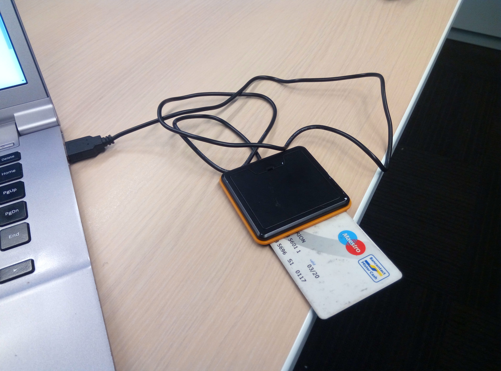

[](https://ffii.org/donate-now-to-save-europe-from-software-patents-says-ffii/)

NOTE: the original author relicenced this software under GPLv3 here: https://github.com/doegox/EMV-CAP

NOTE2: I will update this repo with Doegox's changes and Python2 and Python3 support when I will have some time

About
=====

This tool emulates an EMV-CAP device, to illustrate the article "Banque en
ligne : a la decouverte d'EMV-CAP" published in MISC #56.

Example of EMV-CAP calculators:


Screenshots
===========

USB smartcard reader with a bank card connected to a laptop running Linux:



Command line help:

```
$ ./EMV-CAP -h
usage: EMV-CAP [-h] [-l] [-L] [--tlv PARSETLV]
               [-r {<index>, <reader_substring>}] [-d] [-v] [-m {1,2}]
               [--warmreset {auto,yes,no}]
               [N [N ...]]

EMV-CAP calculator

optional arguments:
  -h, --help            show this help message and exit

Standalone options:
  -l, --listreaders     print list of available readers and exit
  -L, --listapps        print list of available applications on the card and
                        exit
  --tlv PARSETLV        parse a hex string into TLV elements

Global options:
  -r {<index>, <reader_substring>}, --reader {<index>, <reader_substring>}
                        select one specific reader with reader index, name
                        string or sub-string otherwise first reader found will
                        be used.
  -d, --debug           print exchanged APDU for debugging
  -v, --verbose         print APDU parsing

Modes and data:
  -m {1,2}, --mode {1,2}
                        M1/M2 mode selection (mandatory, unless -l or -L is
                        used)
  N                     number(s) as M1/M2 data: max one 8-digit number for M1
                        and max 10 10-digit numbers for M2
  --warmreset {auto,yes,no}
                        Warm reset: yes / no / auto (default) If 'auto' it
                        will perform a warm reset if the ATR starts with 3F
                        (indirect convention)

Examples:
    EMV-CAP --listreaders
    EMV-CAP --listapps
    EMV-CAP --listapps --debug --reader foo
    EMV-CAP -m1 123456
    EMV-CAP -m2
    EMV-CAP -m2 1000 3101234567
```

Mac OSX support
===============

EMV-CAP also works on Mac OSX (tested with Yosemite 10.10.5), you will need to install few dependencies though (you need to have pip and brew installed as prerequesite):

* brew: see the Brew homepage on how to install it
* pip: ```$ sudo easy_install pip```
* swig: ```$ brew install swig```
* pycrypto and pyscard: ```$ sudo pip install pycrypto pyscard ```

Windows 10 support
==================

I have attempted to install the same dependencies for OSX, with cygwin installed, python, gcc, python-pip, etc... I managed to do a ```pip install pycrypto pyscard``` (Successfully installed pycrypto-2.6.1 pyscard-1.9.7). But when I try to run the M2 from bash, I got a protocol error (I have to force the second reader with the -r flag):

```
$ EMV-CAP -r 2 -m2 1000 123456
Traceback (most recent call last):
  File "/usr/bin/EMV-CAP", line 321, in <module>
    (RAPDU, sw1, sw2) = myTransmit(connection, CAPDU, args.debug)
  File "/usr/bin/EMV-CAP", line 188, in myTransmit
    (RAPDU, sw1, sw2) = connection.transmit(hex2lint(CAPDU))
  File "/usr/lib/python2.7/site-packages/smartcard/CardConnectionDecorator.py", line 82, in transmit
    return self.component.transmit(bytes, protocol)
  File "/usr/lib/python2.7/site-packages/smartcard/CardConnection.py", line 146, in transmit
    data, sw1, sw2 = self.doTransmit(bytes, protocol)
  File "/usr/lib/python2.7/site-packages/smartcard/pcsc/PCSCCardConnection.py", line 196, in doTransmit
    'CardConnection.RAW_protocol')
smartcard.Exceptions.CardConnectionException: Invalid protocol in transmit: must be CardConnection.T0_protocol, CardConnection.T1_protocol, or CardConnection.RAW_protocol
```

Todo
====

* make debian packages
* make a pip package
* make a docker image
* add support for some banks with boobank: https://woob.tech/applications/bank
* add curl examples for a webbanking interface of choice
* test a similar python program https://github.com/russss/python-emv

License
=======

Creative Commons Paternité - Pas de Modification 2.0 Belgique (CC BY-ND 2.0 BE): https://creativecommons.org/licenses/by-nd/2.0/be/

Links
=====

* http://connect.ed-diamond.com/MISC/MISC-056/Banques-en-ligne-a-la-decouverte-d-EMV-CAP
* https://sites.uclouvain.be/EMV-CAP/
* http://slideplayer.com/slide/11405563/
* https://github.com/russss/python-emv
